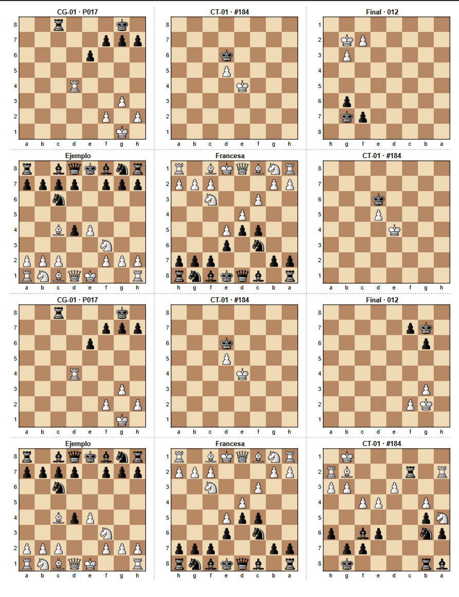

# Chess Diagram Sheet Generator

A Google Sheets + Google Apps Script tool for generating **printable chess diagram sheets from FEN positions**.

The project is designed for players who study chess using physical notebooks, printed diagrams, or over-the-board analysis. Positions can be stored in a Google Sheet, selected with checkboxes, rendered as chess diagrams, and exported automatically to a print-ready PDF.

## Features

- Generate chess diagrams directly from **FEN positions**
- Select which positions to print using checkboxes
- Custom labels for each diagram
- Board orientation from **White's or Black's perspective**
- Optional board coordinates
- Graphical chess pieces using PNG assets
- Up to **12 diagrams per Letter-size page**
- 3 × 4 diagram layout
- Automatic multi-page generation
- Dashed cutting guides between diagrams
- Automatic PDF export
- Robust image insertion with automatic retries
- No external API or server required

## Example

The generated sheets are designed to be printed, cut, and pasted into a physical chess notebook.



## How It Works

The basic workflow is:

FEN positions → Google Sheets → Google Apps Script → Chess diagrams → Printable PDF

The chess positions are stored in a Google Sheet. Google Apps Script
parses each FEN, builds the corresponding board, inserts the graphical
chess pieces, arranges the diagrams on printable pages, and exports the
result as a PDF.

> **Language note:** The current version uses Spanish labels in the
> Google Sheets interface (`Imprimir`, `Orientación`, `Coordenadas`,
> `Blancas`, `Negras`) and Spanish identifiers internally in the
> Apps Script source code. This does not affect functionality.

## Google Sheet Setup

Create a sheet named:

`Posiciones`

## Google Sheet Setup

Create a sheet named:

```text
Posiciones
```

The sheet must contain the following columns:

| Column | Field | Description |
|---|---|---|
| A | Print | Checkbox used to select the position |
| B | ID | Label displayed above the diagram |
| C | FEN | Chess position in FEN notation |
| D | Orientation | `Blancas` or `Negras` |
| E | Coordinates | Checkbox to show board coordinates |

Example:

| Print | ID | FEN | Orientation | Coordinates |
|---|---|---|---|---|
| ☑ | CG-01 · P017 | `8/5pkp/4p3/8/3R4/6P1/5P1P/6K1 w - - 0 1` | Blancas | ☑ |
| ☑ | CT-01 · #184 | `8/8/3k4/3P4/4K3/8/8/8 w - - 0 1` | Blancas | ☑ |

> The current interface uses the Spanish values `Blancas` and `Negras` for board orientation.

## Installation

### 1. Create the spreadsheet

Create a new Google Sheets spreadsheet and add a sheet named:

```text
Posiciones
```

Create the five columns described above.

Set columns **A** and **E** as checkboxes.

### 2. Open Apps Script

From Google Sheets, open:

```text
Extensions → Apps Script
```

### 3. Add the source files

Create two script files:

```text
Codigo.gs
Piezas.gs
```

Copy the corresponding files from this repository into the Apps Script project.

`Codigo.gs` contains the application logic.

`Piezas.gs` contains the chess-piece PNG assets encoded as Base64.

### 4. Save and reload

Save the Apps Script project and reload the Google Sheets spreadsheet.

A new menu should appear:

```text
♟ Ajedrez
```

with the following commands:

```text
Generate diagram sheet
Export sheet to PDF
Generate sheet and PDF
```

The actual menu labels in the current version are in Spanish.

## Usage

Add FEN positions to the `Posiciones` sheet and select the positions you want to print using the checkbox in column A.

For each position:

- Enter an identifier in column B.
- Enter a valid FEN in column C.
- Choose `Blancas` or `Negras` in column D.
- Enable or disable coordinates using column E.

Then select:

```text
♟ Ajedrez → Generar plancha de diagramas
```

The script automatically creates sheets named:

```text
Impresión 1
Impresión 2
Impresión 3
...
```

Each page can contain up to **12 diagrams**, arranged as:

```text
3 columns × 4 rows
```

## PDF Export

To create a printable PDF, select:

```text
♟ Ajedrez → Exportar plancha a PDF
```

The PDF is generated in **Letter size, portrait orientation**, with reduced margins to accommodate the 12-diagram layout.

Multiple `Impresión` sheets are automatically combined into a single multi-page PDF.

The resulting PDF is saved in the same Google Drive folder as the spreadsheet whenever possible.

## Board Orientation

Orientation is controlled independently from the side to move specified in the FEN.

### White orientation

With:

```text
Blancas
```

White is displayed at the bottom of the board.

Files:

```text
a b c d e f g h
```

Ranks:

```text
8
7
6
5
4
3
2
1
```

### Black orientation

With:

```text
Negras
```

Black is displayed at the bottom.

Files are reversed:

```text
h g f e d c b a
```

and ranks are displayed as:

```text
1
2
3
4
5
6
7
8
```

The `w` or `b` field in the FEN determines the side to move but does **not** automatically change the board orientation.

## Diagram Layout

The current layout is optimized for printing **12 diagrams on a Letter-size page**.

Each board uses:

```text
Square size:       27 px
Piece size:        25 px
Coordinate font:    8 px
```

The layout also includes:

- diagram labels;
- optional coordinates;
- narrow vertical spacing;
- dashed cutting guides;
- reduced PDF margins.

The goal is to preserve board readability while maximizing the number of useful diagrams on each printed page.

## Chess Piece Assets

Chess pieces are stored as transparent PNG graphics and embedded directly in `Piezas.gs` as Base64 data.

This approach means the Apps Script project does not need to download external images or access a separate Google Drive asset folder while generating diagrams.

Conceptually:

```text
PNG asset
   ↓
Base64
   ↓
Decoded bytes
   ↓
Blob
   ↓
Google Sheets insertImage()
```

See [`ATTRIBUTION.md`](ATTRIBUTION.md) for information about the chess-piece artwork and its licensing.

## Project Structure

```text
chess-diagram-sheet-generator/
│
├── Codigo.gs
├── Piezas.gs
├── README.md
├── LICENSE
├── ATTRIBUTION.md
│
├── assets/
│   ├── wk.png
│   ├── wq.png
│   ├── wr.png
│   ├── wb.png
│   ├── wn.png
│   ├── wp.png
│   ├── bk.png
│   ├── bq.png
│   ├── br.png
│   ├── bb.png
│   ├── bn.png
│   └── bp.png
│
└── docs/
    └── example-sheet.png
```

## Performance

The current implementation inserts each chess piece as an individual image in Google Sheets.

This provides good print quality but image insertion is currently the main performance bottleneck.

Generation time therefore depends on:

- the number of diagrams;
- the number of pieces in each position;
- Google Apps Script execution time;
- Google Sheets image insertion performance.

For larger batches, generating the diagram sheets and exporting the PDF as separate operations is recommended.

## Roadmap

Potential future improvements include:

- [ ] Render each complete chessboard as a single image
- [ ] Reduce diagram generation time
- [ ] Reduce the number of Google Sheets image operations
- [ ] Add additional chess-piece styles
- [ ] Add automatic orientation based on the side to move
- [ ] Improve asset management
- [ ] Add additional page formats and layouts

A future rendering architecture could change the current process from:

```text
FEN → board → many individual piece images → Google Sheets
```

to:

```text
FEN → complete rendered board → one PNG → Google Sheets
```

This should significantly improve generation speed and reliability.

## Privacy and External Services

The project does not require an external chess API or external server.

FEN parsing and diagram generation are handled through Google Apps Script and Google Sheets.

PDF generation uses Google Sheets' own export functionality.

## License

The source code of Chess Diagram Sheet Generator is released under
the [MIT License](LICENSE).

The bundled Cburnett chess piece artwork was created by
Colin M. L. Burnett and is distributed under the
GPL-2.0-or-later license.

The chess piece artwork is third-party content and is not covered
by the MIT License applied to this project's original source code.

See [ATTRIBUTION.md](ATTRIBUTION.md) for attribution, source,
licensing information, and modifications made for this project.

## Version

Current public release:

```text
v1.0.0
```

This is the first stable public version of the project, featuring FEN parsing, graphical pieces, optional coordinates, board orientation, 12-diagram Letter-size layouts, cutting guides, and multi-page PDF export.
